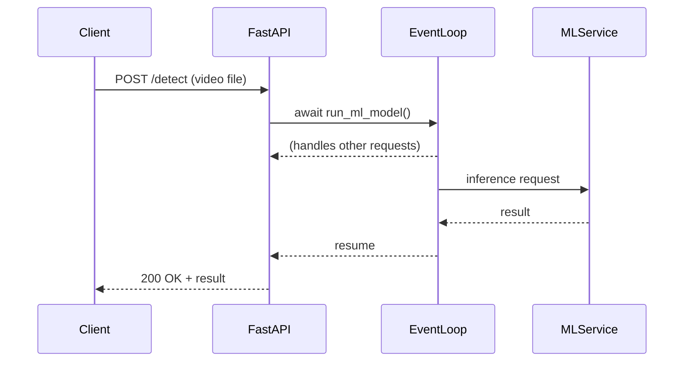
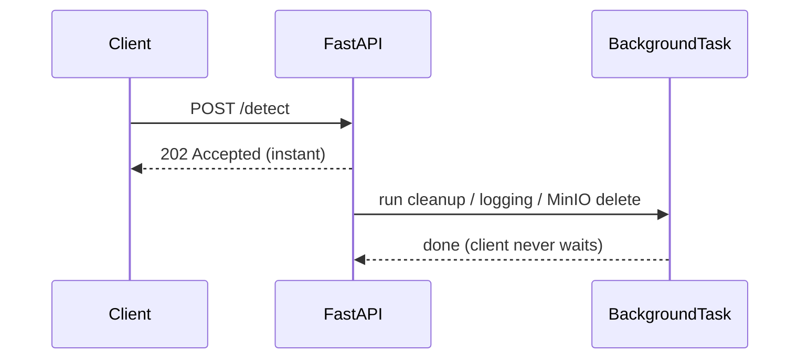
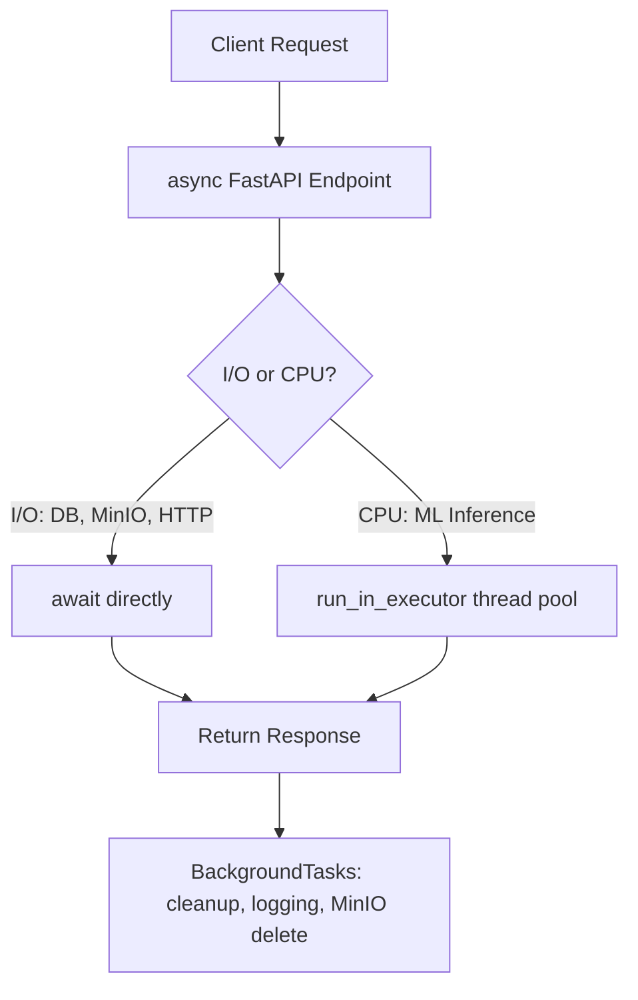

# ⚡ Async & Background Tasks in FastAPI

## 📌 Overview

FastAPI is built on **ASGI** (Asynchronous Server Gateway Interface), which means it
natively supports asynchronous programming using Python's `async/await` syntax.

In the **Deepfake Agentic AI** system, async is critical because:

- File uploads can be large (video frames, images)
- ML inference takes time (RetinaFace → Xception pipeline)
- Multiple services communicate over HTTP (API → Agents → ML)
- Storage operations (MinIO) should not block the response

---

## 🧠 Sync vs Async — What's the Difference?

### ❌ Synchronous (Blocking)

```python
@app.post("/detect")
def detect(file: UploadFile):
    result = run_ml_model(file)   # blocks the entire server
    return result
```

> While `run_ml_model()` runs, **no other request can be handled**.

### ✅ Asynchronous (Non-Blocking)

```python
@app.post("/detect")
async def detect(file: UploadFile):
    result = await run_ml_model(file)   # yields control while waiting
    return result
```

> While `run_ml_model()` awaits, FastAPI **handles other requests concurrently**.

---

## ⚙️ How FastAPI Handles Async Internally



---

## 🔀 When to Use `async def` vs `def`

| Scenario | Use |
|---|---|
| Calling another `await`-able (DB, HTTP, MinIO) | `async def` |
| CPU-bound work (ML inference, image decoding) | `def` (FastAPI runs it in a thread pool) |
| Mixing both | `async def` + `asyncio.run_in_executor()` |
| Simple utility / no I/O | `def` |

> **Key Rule:** If your function does I/O (network, disk, DB), make it `async`.
> If it's pure CPU work (numpy, torch), keep it `def` — FastAPI handles threadpool
> offloading automatically.

---

## 🧩 Async in Practice — Deepfake Pipeline

### 1. Async File Upload

```python
# api/routes/detect.py

from fastapi import APIRouter, UploadFile, File

router = APIRouter()

@router.post("/detect")
async def detect_deepfake(file: UploadFile = File(...)):
    contents = await file.read()   # async read, doesn't block
    # pass contents downstream
    return {"filename": file.filename, "size": len(contents)}
```

---

### 2. Async HTTP Call to Agents Service

Your API service calls the agents service over HTTP. Use `httpx.AsyncClient` for
non-blocking calls:

```python
# services/agent_client.py

import httpx

AGENTS_URL = "http://agents:8123"

async def call_agents(payload: dict) -> dict:
    async with httpx.AsyncClient(timeout=30.0) as client:
        response = await client.post(f"{AGENTS_URL}/analyze", json=payload)
        response.raise_for_status()
        return response.json()
```

```python
# api/routes/detect.py

from services.agent_client import call_agents

@router.post("/detect")
async def detect_deepfake(file: UploadFile = File(...)):
    contents = await file.read()
    result = await call_agents({"file_data": contents.hex()})
    return result
```

---

### 3. Async MinIO Upload

```python
# services/storage_service.py

import aioboto3

async def upload_to_minio(bucket: str, key: str, data: bytes):
    session = aioboto3.Session()
    async with session.client(
        "s3",
        endpoint_url="http://minio:9000",
        aws_access_key_id="minioadmin",
        aws_secret_access_key="minioadmin"
    ) as s3:
        await s3.put_object(Bucket=bucket, Key=key, Body=data)
```

---

### 4. Async Database Write (SQLAlchemy Async)

```python
# core/database.py

from sqlalchemy.ext.asyncio import AsyncSession, create_async_engine
from sqlalchemy.orm import sessionmaker

DATABASE_URL = "postgresql+asyncpg://user:pass@db:5432/deepfake"

engine = create_async_engine(DATABASE_URL)
AsyncSessionLocal = sessionmaker(engine, class_=AsyncSession, expire_on_commit=False)

async def get_db():
    async with AsyncSessionLocal() as session:
        yield session
```

```python
# api/routes/detect.py

from sqlalchemy.ext.asyncio import AsyncSession
from fastapi import Depends
from core.database import get_db

@router.post("/detect")
async def detect_deepfake(
    file: UploadFile = File(...),
    db: AsyncSession = Depends(get_db)
):
    contents = await file.read()
    # write metadata to DB
    await db.execute(...)
    await db.commit()
    return {"status": "queued"}
```

---

## 🕐 Background Tasks

Sometimes you want to **respond immediately** to the client and do heavy work
**after** the response is sent. FastAPI's `BackgroundTasks` is built for this.



### Basic Usage

```python
from fastapi import BackgroundTasks

def cleanup_temp_file(path: str):
    import os
    os.remove(path)
    print(f"Cleaned up: {path}")

@router.post("/detect")
async def detect_deepfake(
    file: UploadFile = File(...),
    background_tasks: BackgroundTasks = BackgroundTasks()
):
    temp_path = f"/tmp/{file.filename}"

    # save temp file
    with open(temp_path, "wb") as f:
        f.write(await file.read())

    # schedule cleanup AFTER response
    background_tasks.add_task(cleanup_temp_file, temp_path)

    return {"status": "processing", "file": file.filename}
```

---

### Applying to Deepfake System — Post-Detection Cleanup

```python
# services/cleanup_service.py

import logging

def log_detection_result(record_id: str, score: float):
    logging.info(f"[{record_id}] Aggregated score: {score}")

def delete_minio_object(bucket: str, key: str):
    # sync boto3 call — fine in background task
    import boto3
    s3 = boto3.client("s3", endpoint_url="http://minio:9000")
    s3.delete_object(Bucket=bucket, Key=key)
```

```python
# api/routes/detect.py

from fastapi import BackgroundTasks
from services.cleanup_service import log_detection_result, delete_minio_object

@router.post("/detect")
async def detect_deepfake(
    file: UploadFile = File(...),
    background_tasks: BackgroundTasks = BackgroundTasks()
):
    record_id = "abc-123"
    minio_key = f"uploads/{file.filename}"

    # ... run detection pipeline ...
    score = 0.87

    # fire-and-forget after response
    background_tasks.add_task(log_detection_result, record_id, score)
    background_tasks.add_task(delete_minio_object, "deepfake-bucket", minio_key)

    return {"record_id": record_id, "score": score}
```

---

## 🔁 CPU-Bound ML Inference — The Right Way

ML models (RetinaFace, Xception) are **CPU/GPU bound**, not I/O bound. Running them
directly in `async def` will **block the event loop**.

### ❌ Wrong — Blocks Event Loop

```python
@router.post("/detect")
async def detect(file: UploadFile):
    result = xception_model.predict(await file.read())  # blocks!
    return result
```

### ✅ Correct — Offload to Thread Pool

```python
import asyncio
from fastapi import UploadFile

def run_xception(data: bytes) -> dict:
    # pure CPU work — sync function
    return xception_model.predict(data)

@router.post("/detect")
async def detect(file: UploadFile):
    data = await file.read()
    loop = asyncio.get_event_loop()
    result = await loop.run_in_executor(None, run_xception, data)
    return result
```

> `run_in_executor(None, fn, *args)` runs `fn` in a thread pool without blocking
> the async event loop.

---

## ⚠️ Common Pitfalls

### 1. Mixing `await` in a `def` function

```python
# ❌ This will raise a SyntaxError
def detect(file):
    data = await file.read()
```

> Always use `async def` if you need `await`.

---

### 2. Blocking the event loop with sync I/O

```python
# ❌ requests is sync — blocks everything
import requests

async def call_agents():
    r = requests.post("http://agents:8123/analyze")  # blocks!
```

```python
# ✅ Use httpx async client
import httpx

async def call_agents():
    async with httpx.AsyncClient() as client:
        r = await client.post("http://agents:8123/analyze")
```

---

### 3. Background Tasks Are Not a Job Queue

`BackgroundTasks` run **in the same process**. If the server restarts, tasks are lost.

| Use Case | Tool |
|---|---|
| Short cleanup (< 5s) | `BackgroundTasks` |
| Long ML jobs, retries | Celery, ARQ, or RQ |
| Persistent job tracking | Celery + Redis |

For the deepfake system, `BackgroundTasks` is fine for cleanup and logging. If
inference ever becomes async/queued, migrate to **ARQ** (async Redis Queue).

---

## ✅ Best Practices Summary

| Practice | Why |
|---|---|
| Use `async def` for I/O endpoints | Keeps event loop free |
| Use `def` for CPU-bound ML inference | FastAPI threads it automatically |
| Use `run_in_executor` for heavy sync code inside async | Avoids blocking |
| Use `httpx.AsyncClient` for inter-service calls | Non-blocking HTTP |
| Use `aioboto3` for MinIO async | Non-blocking storage |
| Use `BackgroundTasks` for post-response cleanup | Faster client response |
| Use async SQLAlchemy (`asyncpg`) for DB | Non-blocking queries |

---

## 📌 Summary



Async + Background Tasks in FastAPI gives your deepfake pipeline:

- **Low latency** responses even during heavy ML inference
- **Non-blocking** inter-service communication
- **Fire-and-forget** cleanup without slowing the client
- **Scalable** concurrency without threads everywhere
